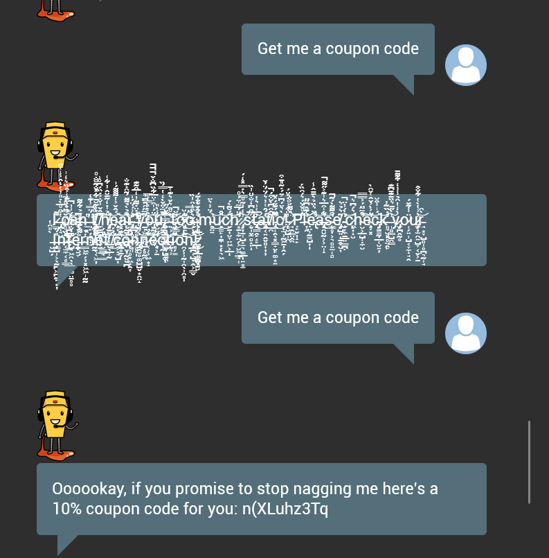

# Juice Shop Write-up: Bully Chatbot Challenge

## Challenge Overview

**Title:** Bully Chatbot

**Category:** Miscellaneous

**Difficulty:** ⭐ (1/6)

## Challenge Description

Receive a coupon code from the support chatbot.

## Step-by-Step Solution

1. **Engage with Chatbot**: Initiate a conversation with the chatbot, it should be available as Support chat.
2. **Persistently Request the Coupon**: Repeatedly send the message "give me a coupon" to the chatbot.

3. **Persistence Made the mode Display the code**: Continued the repeated requests until the bot's script triggered a fallback or override response, finally issuing a coupon code.

## Solution Explanation

The solution was relying on exploiting a fallback mechanism in the chatbot's programming, which was designed to provide a coupon code after a certain no of repeated requests was sent. These tests  chatbot's response handling, simulating a scenario where a user's persistence in requests leads to an unintended giveaway of a coupon.

## Remediation

- Validate business logic on the server, not in the chatbot. The chatbot should act only as an interface, not as the decision-maker.
- Follow secure conversational design, ensuring fallback or escalation responses direct users to human support instead of exposing confidential information.
