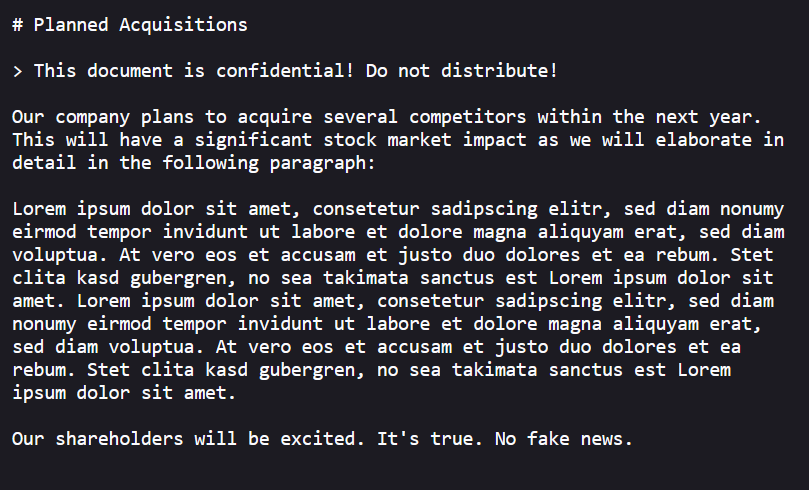

# Juice-Shop Write-up: Confidential Document Challenge

## Challenge Overview

**Title:** Confidential Document\
**Category:** Sensitive Data Exposure\
**Difficulty:** ⭐ (1/6)

## Challenge Description

Access a confidential document.
Confidential document leak to the unauthorized exposure of sensitive information, which can occur due to security vulnerabilities or negligence. 

## Step-by-Step Solution

1. **Access the FTP Server**: Navigate to the FTP server by visiting it at `[IP]:[PORT]/ftp` in browser.
2. **Identify the Target File**: Locate the file `acquisition.md` among the list of files on the server. This might contain information about company acquisitions(Assets), which is a confidential topic.
3. **Analyze the Content**: The document explicitly mentions it as confidential and must not be distributed.

## Remediation

- Encrypt confidential files both at rest and during transmission using HTTPS/TLS.
- Log and monitor file access to detect unauthorized download attempts or unusual access patterns.
- Regularly review and remove unnecessary or outdated confidential documents from publicly accessible systems.
