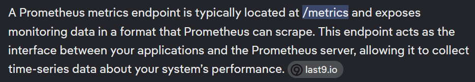

# Juice-Shop Write-up: Exposed Metrics Challenge

## Challenge Overview

**Title:** Exposed Metrics\
**Category:** Sensitive Data Exposure\
**Difficulty:** ⭐ (1/6)

## Challenge Description

Find the endpoint that serves usage data to be scraped by a popular monitoring system.
Exposed metrics in OWASP refer to sensitive data that can be accessed through publicly available endpoints.

## Solution

1. **Review Application Documentation**: Examine the official documentation of Prometheus to understand its default configurations. Prometheus typically exposes metrics at the `/metrics` endpoint.

   

3. **Access the Endpoint**: Visited `/metrics` in the browser, to find the metrics endpoint as per the default configuration of Prometheus.

4. **Exposed Data**: 
   - Startup times for services.
   - CPU and memory usage statistics.
   - Runtime and system health data.

## Remediation

 - Restrict access to sensitive endpoints by changing their default links and implementing IP whitelisting.
 - Encoding access links with passwords for further protection.
