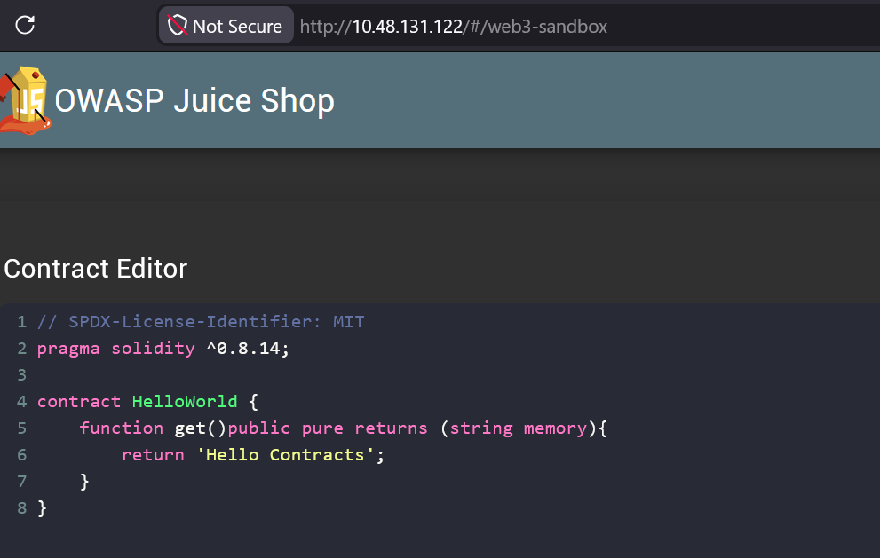

# Juice Shop Write-up: Web3 Sandbox Challenge

## Challenge Details

**Difficulty** : ✯.\
**Category** : Broken Access Control

**Description**

- Find an accidentally deployed code sandbox for writing smart contracts on the fly.
- Explores the concept of broken access controls within web applications, particularly in environments involving Web3 technologies.
  
## Solution

- **Identify the Issue**: Begin by exploring different URLs related to Web3 functionalities on the application,  Utilized a simple guessing approach.
    
- **Accessing the Sandbox:**: Upon navigating to the correct URL for web3 sandbox, you will find a fully functional Web3 code sandbox environment. This sandbox included features for editing, compiling, and deploying Ethereum smart contracts directly from the browser.

  

## Remediation

- **Server-Side Enforcement**: Ensure that all access control checks are implemented on the server side, rather than relying solely on client-side validations.

- **Access Control Matrix**: Develop and maintain an access control matrix that clearly defines user roles and their permissions. This helps in systematically enforcing access rules.

- **Regular Code Reviews**: Conduct thorough code reviews to identify and rectify any access control flaws. This includes checking for proper implementation of role-based access controls (RBAC). 
