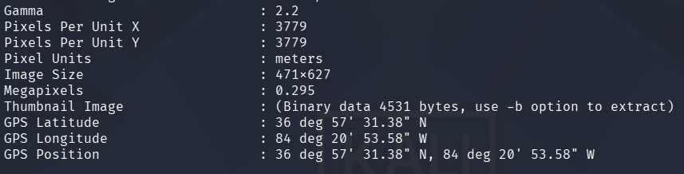

# Juice Shop Write-up: Meta Geo Stalking Challenge

## Challenge Details

**Difficulty** : ✯✯.\
**Category** : Sensitive Data Exposure

**Description**

- Determine the answer to John's security question by looking at an upload of him to the Photo Wall and use it to reset his password via the Forgot Password mechanism.
- This challenge highlights the risks associated with sensitive data exposure, particularly through the use of EXIF metadata in images
  
## Solution

- Downloaded the image from Photo Wall that was uploaded by John

- Run Exiftool on the image and find the GPS coordinates that was taken from.

  

- With the location identified as Daniel Boone National Forest, this will be used as the answer to the security question and  reset John’s password.

## Remediation

- **Metadata Scrubbing**: Encourage users to remove metadata from photos before uploading them to public platforms, or implement server-side processes to automatically strip this data.
  
- **Use Non-Descriptive Security Questions**: Employ security questions that do not directly relate to information that could be publicly deduced or found through OSINT techniques. Better option is to not use security questions and rather send an email for resetting password.
  
