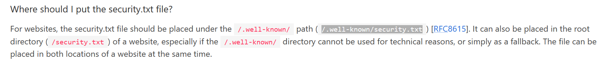

# Juice Shop Write-up: Security Policy Challenge

## Challenge Details

**Difficulty** : ✯✯.\
**Category** : Miscellaneous

**Description**

- Behave like any "white-hat" should before getting into the action.
- Find the Security policy that is hidden in the name of `security.txt`.
  
## Solution

- `Security.txt` is a draft by the Internet Engineering Task Force (IETF) aimed at making it easier for organizations to disclose security practices. Websites are encouraged to place this file under the /.well-known/ directory according to the draft's guidelines (https://securitytxt.org/).

  

- Visiting the path will solve the challenge.

## Remediation

- **Use Environment Variables**:	Store sensitive configurations in environment variables instead of hardcoding them.
  
- **Regular Security Audits**:	Conduct regular audits to identify and fix potential vulnerabilities.
  
- **Educate Development Teams**:	Train developers on secure coding practices to prevent future vulnerabilities.
  
