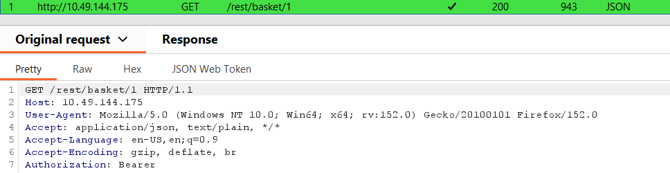

# Juice Shop Write-up: View Basket Challenge

## Challenge Details

**Difficulty** : ✯✯.\
**Category** : Broken Access Control

**Description**

- View another user's shopping basket.
- Find an IDOR vulnerability in shopping basket on site.
  
## Solution

- Intercept the request sent to basket by clicking on basket icon.

    
    
- Change the basket ID to see if the you see another user's shopping basket.

## Remediation

- **Server-Side Authorization Checks**:	Verify user permissions before granting access to sensitive data.
  
- **Response Codes**:	Return a 403 response for unauthorized access attempts.
  
- **Security Audits**:	Regularly assess the application for vulnerabilities.
  
