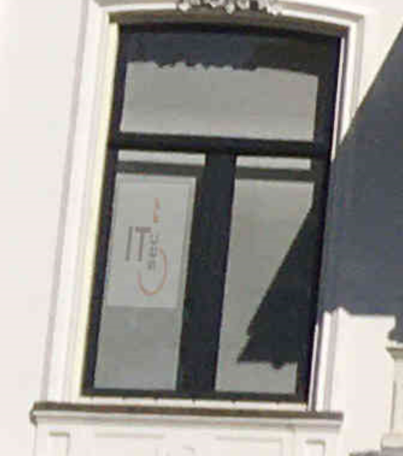

# Juice Shop Write-up: Visual Geo Stalking Challenge

## Challenge Details

**Difficulty** : ✯✯.\
**Category** : Sensitive Data Exposure

**Description**

- Determine the answer to Emma's security question by looking at an upload of her to the Photo Wall and use it to reset her password via the Forgot Password mechanism.
- This challenge tests abilities in image analysis, OSINT techniques to find relevant info about a target.
  
## Solution

- Emma's post on a social media-like platform includes a photo of a building with a caption referencing a past workplace.

- Task is to identify Emma's former workplace through the image provided.

- The term "ITsec" will be visible by zooming the Post. Using "ITsec" as the security question answer will allow the password reset for Emma's account.

  

## Remediation

- **Use Environment Variables**:	Store sensitive configurations in environment variables instead of hardcoding them.
  
- **Regular Security Audits**:	Conduct regular audits to identify and fix potential vulnerabilities.
  
- **Educate Development Teams**:	Train developers on secure coding practices to prevent future vulnerabilities.
  
