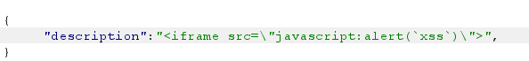

# Juice Shop Write-up: API-only XSS Challenge

## Challenge Details

**Difficulty** : ✯✯✯.\
**Category** : XSS

**Description**

- Perform a persisted XSS attack with <iframe src="javascript:alert(`xss`)"> without using the frontend application at all.
- API-only XSS is a specific type of XSS attack. It occurs when malicious scripts are injected through an API rather than through a traditional web interface.
  
## Solution

- **Find the Endpoint** : Use Burp-Suite check for the requests which are on `api` endpoints.
- From the requests `api/Products/`  end-point which will give us the details about our Products and serve as a endpoint for XSS.

-   

- Insert payload into any Product id use PUT method and inside data to change the description permanently also change content-type since it will be JSON data.

- Payload is injected successfully and challenge is completed.

## Remediation

- **Input Validation**: Ensure all user inputs are validated against a strict set of rules.

- **Output Encoding**: Encode data before rendering it in the browser to prevent script execution.

- **Use Security Libraries**: Implement libraries that help sanitize inputs and outputs effectively.
  
