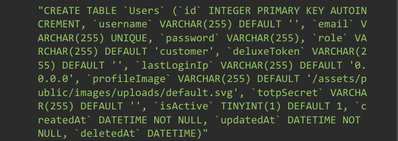

# Juice Shop Write-up: Database Schema Challenge

## Challenge Details

**Difficulty** : ✯✯✯.\
**Category** : Injection

**Description**

- Exfiltrate the entire DB schema definition via SQL Injection.
- The Task involves finding database schema of the site which outlines the structure of its database, which is crucial for understanding how data is organized and accessed.
  
## Solution

- **Find Vulnerable Endpoint** : Identify a parameter within the application that is susceptible to SQL injection. In this case its the `q` parameter in search query which is vulnerable.

- **Schema Extraction** : Use the union query displayed in response when a single quote `'` is used. After few trail and error the resulting payload will look something like this :
-  `test')) UNION SELECT 1, 2, 3, 4, 5, 6, 7, 8, sql FROM sqlite_schema--`

-   

## Remediation

- **Use Prepared Statements**: Avoid SQL injection by using parameterized queries or prepared statements.

- **Validate and Sanitize Inputs**: Ensure that all user inputs are validated and sanitized to prevent malicious data from affecting SQL queries.

