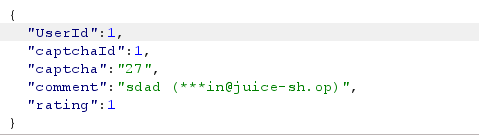

# Juice Shop Write-up: Forged Feedback Challenge

## Challenge Details

**Difficulty** : ✯✯✯.\
**Category** : Broken Access Control

**Description**

- Post some feedback in another user's name.
- This vulnerability highlights issues with user identity management within web applications.
  
## Solution

- **Testing Feedback Feature**: Login and submit a dummy feedback and intercept the request in burp.

  
    
- Change the `userid` parameter to post review impersonating another user.

- Submit and check if the feedback appears under the targeted user's profile.

## Remediation

- **Enhanced Server-Side Validation**: Ensure that actions like posting feedback are validated against the user's session to confirm identity.

- **Secure Session Management**: Implement practices that securely map session IDs to user IDs, preventing unauthorized actions based on user-provided data.

- **Audit and Monitoring**: Regularly review access logs and user actions to detect and respond to unauthorized activities. 
  
