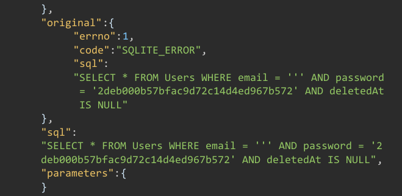

# Juice Shop Write-up: GDPR Data Erasure Challenge

## Challenge Details

**Difficulty** : ✯✯✯.\
**Category** : Broken Authentication

**Description**

- Log in with Chris' erased user account.
- Task involves Logging into a deleted or erased account thru SQL injection.
  
## Solution

- **SQLi Testing** : By testing for sqli in the login page the error from response hints about a `DeletedAt` parameter in loggin in.

-   

  
- **Accessing Deleted Account** : Modifying the login request to include an SQL injection payload that alters the query logic to return an account where DeletedAt is NOT NULL. The payload would look like this:
  ` ' OR DeletedAt IS NOT NULL --`.

- By crafting a query that ignored the intended logic of only allowing access to accounts with a null `DeletedAt` field, access was granted to the deleted Account.

## Remediation

- **Prepared Statements**: Use prepared statements with bound, typed parameters to prevent SQL injection.

- **Enhanced Login Security**: Implement multi-factor authentication to reduce the risk of unauthorized access.

- **Proper Account Handling**: Ensure that account deletion or deactivation processes are robust and do not leave loopholes that could allow deleted accounts to be accessed.

  
