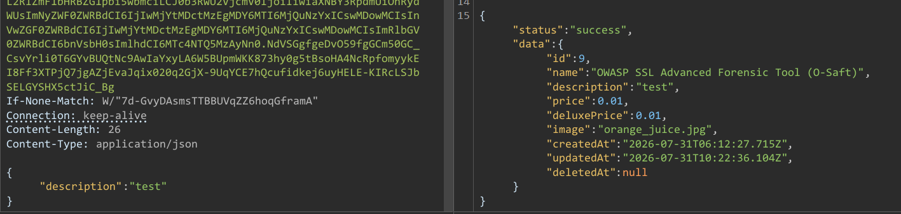

# Juice Shop Write-up: Product Tampering Challenge

## Challenge Details

**Difficulty** : ✯✯✯.\
**Category** : Broken Access Control

**Description**

- Change the href of the link within the OWASP SSL Advanced Forensic Tool (O-Saft) product description into `https://owasp.slack.com`.
  
## Solution

- **API Endpoint Discovery** : Use the browser or a tool to list all product details by accessing the `/api/Products` endpoint.

   

- Using the above api endpoint its visible that this endpoint is vulnerable to data override. Construct a JSON payload with the description field altered to include : `<a href="https://owasp.slack.com" target="_blank">More...</a>`.

- Submit the modified payload to the API endpoint updating product details.

## Remediation

- **Implement Strict Role-Based Access Controls (RBAC)**: Ensure that only authorized personnel can modify product details.

- **Sanitize and Validate All Inputs**: Properly sanitize and validate all user inputs, especially in product descriptions that allow HTML content.
  
